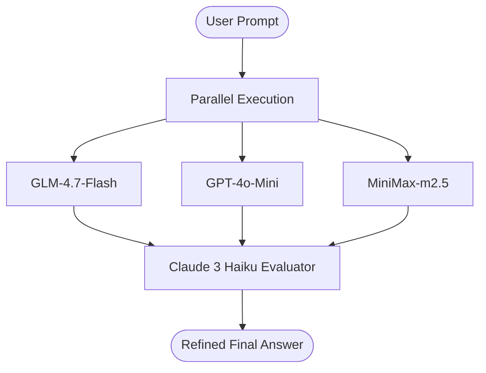

# AnswerOrchestrator

A generative AI orchestrator that queries multiple models in parallel and synthesizes their responses to produce a higher-quality final answer.

## Process Flow



---

## Models and Providers Used
All LLMs are orchestrated via the **OpenRouter** API gateway:
- **Zhipu GLM-4.7-Flash** (`z-ai/glm-4.7-flash`)
- **OpenAI GPT-4o-Mini** (`openai/gpt-4o-mini`)
- **MiniMax-m2.5** (`minimax/minimax-m2.5`)
- **Anthropic Claude 3 Haiku** (`anthropic/claude-3-haiku`) — *Used as the evaluator/judge*

---

## How the Self-Consistency Flow is Implemented
1. **Parallel Inferences**: The backend concurrently sends the user's prompt to the three candidate models (GLM, GPT, and MiniMax) using `Promise.allSettled` to prevent network blocking.
2. **Robustness**: If one model fails, the system continues with the remaining successful responses.
3. **Consolidation**: The system compiles the outputs and passes them to the evaluator model (**Claude 3 Haiku**).
4. **Synthesis**: The evaluator compares the responses, corrects factual errors, combines unique insights, removes redundancy, and outputs a refined final answer.

---

## How to Run Locally

### 1. Server Setup
```bash
cd server
bun install
# Set OPENROUTER_API_KEY in .env
bun start
```

### 2. Client Setup
```bash
cd client
bun install
bun run dev
```
Navigate to `http://localhost:5173`.
